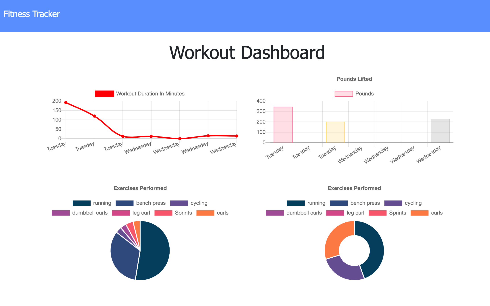
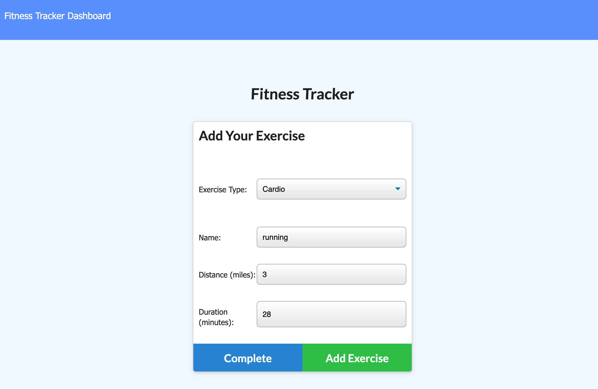

# Track Your Workouts

## Deployed

Check out the deployed web app here 👉 [Track Your Workouts 💪](https://track-your-workoutss.herokuapp.com/)

## Description

This is a workout tracking application that utilizes Javascript, HTML and CSS for frontend functionality. MongoDB/Mongoose are being used to store the data and the deployment is used on Heroku via Atlas.

## Screenshots

## Usage

Log resistance and cardio based exercises on different workouts, and then view your stats via the dashboard!

## Contributions

Submit a pull request.

## Questions

https://github.com/g-strick

## License

